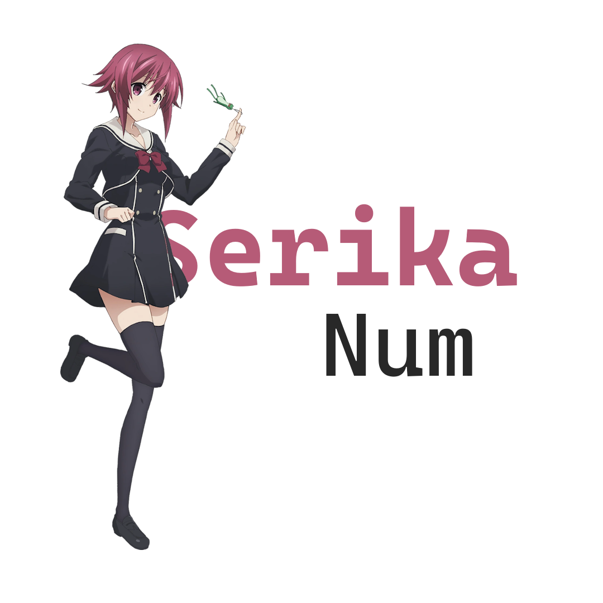

  

# SerikaNum

Onoe Serika's go-to big number library for small and large-scale incremental games! 

  

SerikaNum is the base library used for basic big number calculations, utilising two number primitives to reach up to 10^^308. Which is pretty huge! Not that huge, though. If you want something truly outstanding, check
out [OmegaNum](https://create.roblox.com/store/asset/11646892509/OmegaNum-Readable), going even above Graham's number.

To truly enjoy SerikaNum's benefits, try using OnoeNum! It's a wrapper library to balance performance and development speed, being fast enough that
you wouldn't have to worry while keeping it simple.

Okkei? Ah, okkei.